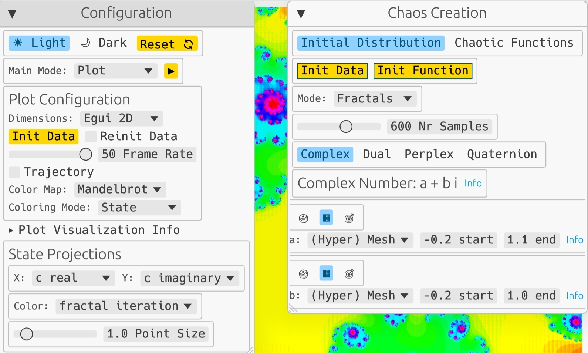
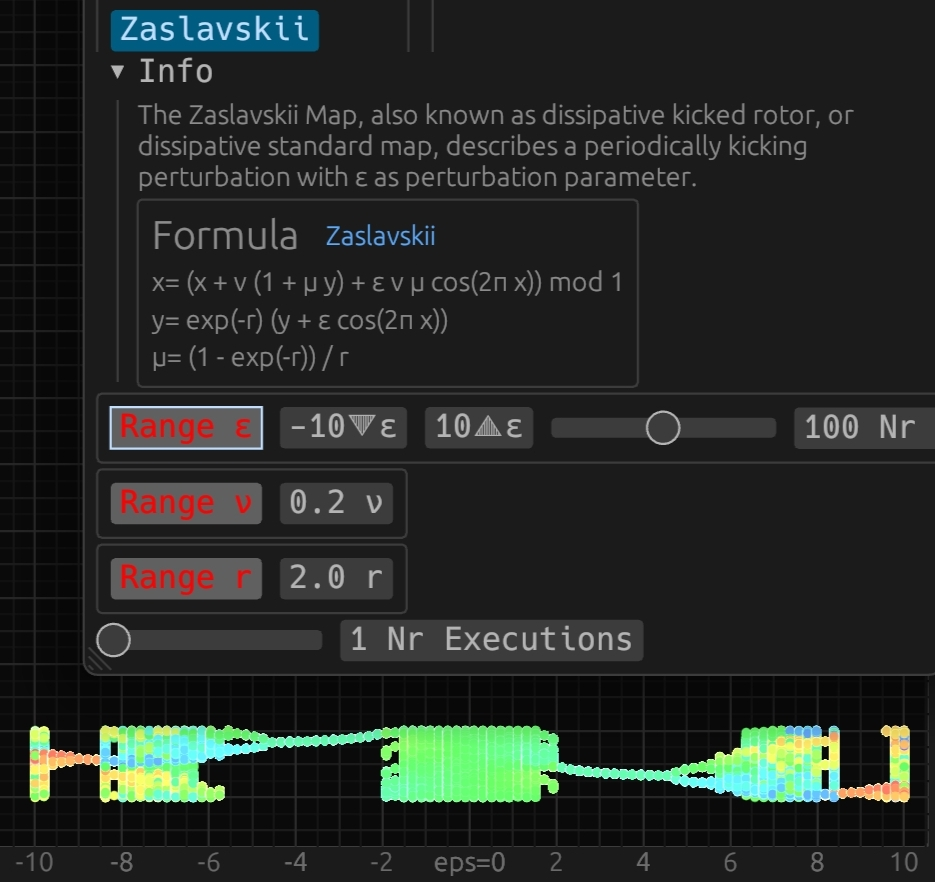

# RustyChaosCraftor
[](./LICENSE) [](https://github.com/tomtuamnuq/rusty-chaos-craftor/actions/workflows/pages.yml) 
[](https://github.com/tomtuamnuq/rusty-chaos-craftor/actions/workflows/test.yml) 
[Live App ](https://tomtuamnuq.github.io/rusty-chaos-craftor/) 
## Overview
RustyChaosCraftor is an interactive exploration tool for visualizing dynamics in chaotic systems. Driven by a fascination with the complex patterns emerging from simple mathematical constructs, this project aims to provide profound insights into chaos theory through highly customizable visualization techniques.


### Core Functionality
- Multidimensional real-time visualization of chaotic functions, fractals, and particle systems.

### Motivation
- A personal journey into chaos theory and mathematical aesthetics.
- The desire to learn Rust and explore WebAssembly (WASM).

### Goal
- To facilitate the exploration of chaos theory through detailed visualizations such as bifurcation diagrams and colormaps.
- To examine the impact of initial conditions and minor parameter variations on chaotic systems.
- To analyze various types of fractals, attractors, and number systems within chaos theory.

## Features
- **Efficient Chaos**: 1D, 2D, 3D, and 4D discrete chaotic maps implemented in Rust, generating a diverse array of patterns.


[comment]: (./assets/screenshots/select_maps.gif)

- **Dynamic Systems**: Live solutions of 2D, 3D, and 4D ordinary differential equations, creating visually stunning attractors.


[comment]: (./assets/screenshots/attractor_rikitake.gif)

- **Particle Simulation**: An interactive N-Body problem solver in 2D and 3D, exploring attractive and repulsive forces.


[comment]: (./assets/screenshots/particle_3d.gif)


**Composable Fractal Generation**: Support for four number systems (Complex, Dual, Perplex numbers, Quaternions) and combinable algorithms such as Picard-Mann iteration with biomorphic effects.

<p float="left">
  
   
  
   
</p>

- **Parameter Exploration**: Bifurcation analysis for all features, offering deep dives into system dynamics.

- **Initial Condition Analysis**: A wide range of initial distributions to study the effects on system behavior.
- **WASM Web Application**: Easily accessible web application with the option to compile natively across all platforms.

## Installation
This project was tested with stable version ˋrustc 1.76.0ˋ of the Rust toolchain. Install it with `rustup install 1.76.0`.

### Native
For local testing on native platforms, execute `cargo run --release`. Linux users must install necessary libraries for `eframe` with:

```bash
sudo apt-get install libxcb-render0-dev libxcb-shape0-dev libxcb-xfixes0-dev libxkbcommon-dev libssl-dev
```

Fedora Rawhide users should run:

```bash
dnf install clang clang-devel clang-tools-extra libxkbcommon-devel pkg-config openssl-devel libxcb-devel gtk3-devel atk fontconfig-devel
```

The app configuration is automatically saved in the user's data directory on shutdown and every 30 seconds during autosave. The exact location of the file depends on the operating system. For example, on Linux, the file is located at `~/.local/share/rustychaoscraftor/app.ron`.

### Web
For web deployment, compile to [WASM](https://en.wikipedia.org/wiki/WebAssembly) using [Trunk](https://trunkrs.dev/):
1. Add the WASM target: `rustup target add wasm32-unknown-unknown`.
2. Install Trunk: `cargo install --locked trunk`.
3. Serve locally with `trunk serve --port=8043`, automatically rebuilding on changes.
4. Access the app at `http://127.0.0.1:8043/index.html#dev`. The `#dev`deactivates caching to view a currently developed version.

The app configuration is saved in the browser's local storage every 30 seconds. Clearing website data may resolve serialization issues.

## Community and Support
To contribute or seek support, open an issue in this repository. Questions, feedback, and contributions are welcome. For any inquiries, please feel free to open an issue.

## Acknowledgments
Special thanks to the following Rust crates that made this project possible:

- `egui`: The intuitive frontend framework. [Repository](https://github.com/emilk/egui)
- `egui_plotter`: Integration of Plotters 3D chart into the egui main panel. [Repository](https://docs.rs/egui-plotter)
- `plotters`: The powerful backend for 3D plotting capabilities. [Repository](https://github.com/plotters-rs)
- `ode_solvers`: For simulating particle systems and chaotic differential equations. [Repository](https://github.com/srenevey/ode-solvers)

I would like to express my gratitude to the following authors and sources for providing the mathematical foundations of the chaotic discrete maps, systems of ordinary differential equations, and fractal set generators that power this project. Their work has been instrumental in creating this interactive exploration tool for chaos theory. All references can also be found in the **Info** tooltips of the GUI.

### Discrete Maps
- Paul Bourke for the **De Jong Ring** and **Clifford** attractors, which are two-dimensional chaotic maps that produce complex and beautiful patterns. [Website](https://paulbourke.net/fractals/)
- Shah et al. for a **three-dimensional** chaotic map that has applications in digital audio security. [Publication](https://doi.org/10.1007/s11042-021-10697-3)
- Huang et al. for a *three-dimensional discrete **memristive** chaotic system that has infinite wide parameter range and coexisting attractors*. [Publication](http://dx.doi.org/10.21203/rs.3.rs-1109068/v1)
- Hamadneh et al. for a **four-dimensional** *fractional chaotic map with constant and variable order*. [Publication](https://doi.org/10.3390/math11204332)

### Systems of Ordinary Differential Equations
- Paul Bourke for the **Burke-Shaw** system, which is a three-dimensional chaotic system with different symmetries and bifurcations. [Website](https://paulbourke.net/fractals/burkwshaw)
- Sambas et al. for the description of the **Genesio-Tesi** system in their work *Design, Analysis of the Genesio Tesi Chaotic System and its Electronic Experimental Implemenation* [Publication](https://paulbourke.net/fractals/burkwshaw)
- Zhang et al. for the *analysis of three species **Lotka-Volterra** food web models with omnivory*. [Publication](https://doi.org/10.1016/j.jmaa.2015.01.035)
- Ababneh for a new **four-dimensional** chaotic attractor, which has a complex structure and a wide range of parameters. [Publication](https://doi.org/10.1016/j.asej.2016.08.020)
- Wang, Feng and Chen for a new **four-dimensional** chaotic system. [Publication](https://doi.org/10.3389/fphy.2022.906138)

### Fractal Configurations and Algorithms
- Paul Bourke for the probability, sinus, sinh, and zubieta Julia set generators, which are complex functions that produce fractal patterns based on the initial conditions. [Website](https://paulbourke.net/fractals/)
- Li, Wang, and Chen for Algorithm 1 in *On the **quaternion** Julia sets via Picard–Mann iteration*. [Paper](https://doi.org/10.1007/s11071-023-08785-0)
- Gdawiec, Fariello and Santos for Algorithm 3 in *A novel approach to generate Mandelbrot sets, Julia sets and **biomorphs** via viscosity approximation method*. [Paper](https://doi.org/10.1016/j.chaos.2022.112540)
- Bankers et al. for their work *Julia and Mandelbrot Sets for Dynamics over the Hyperbolic Numbers*, which motivated me to include **Perplex** numbers in this project. Perplex (also known as hyperbolic) numbers are a variation of complex numbers that encode geometric properties of the Minkowski space. [Paper](https://doi.org/10.3390/fractalfract3010006)
